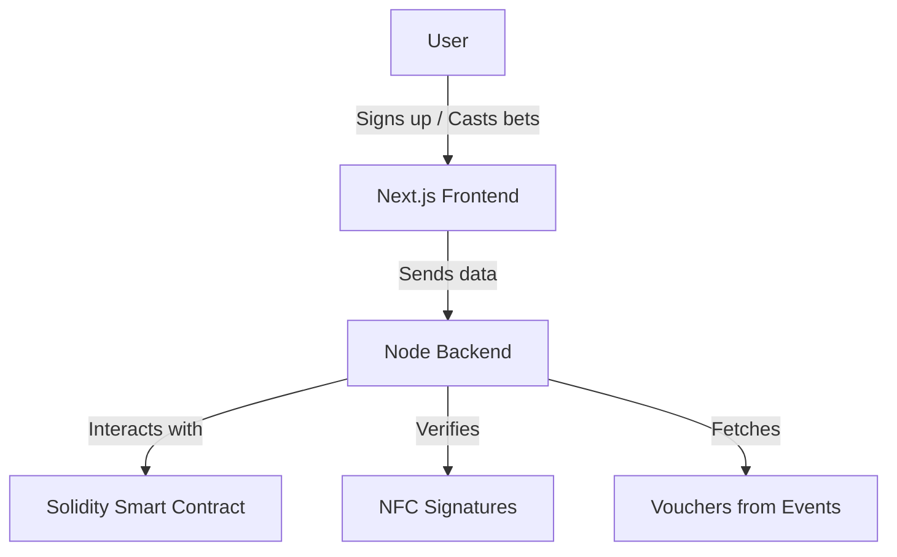

# Banana-Perks
## Created for events wanting to reward ETHGlobal attendees

THIS PROJECT IS ONLY USABLE ON MOBILE.

Events platform designed for ETHGlobal attendees to get perks at events with seamless onboarding through NFC wristband sign-ins.

## ⁉️ Description
We discovered that most web3 events are still using physical tokens or even paper for drink/food vouchers. Leveraging this insight, we want to create a platform tested first by ETHGlobal attendees to redeem drink/food at events.

Attendees can easily join by scanning their NFC wristbands and redeeming transactions are signed directly by their NFC private keys.

It should help to onboard any attendee and not only from ETHGlobal events.

## 📦 How it's made

## 💻 Technical Preview

## Explanation of the steps

1. Backend starts the event period by calling the contract. Users can now go to our website, select event that they wish to redeem at and submit their wish of voucher by clicking on the "redeem voucher"-button.
2. To make sure the user is an ETHGlobal Brussels attendee and to ensure frictionless onboarding, the user is prompted to scan his NFC wristband with his phone. The NFC wristband will sign a message containing the voting data collected in step 3.
3. The signed message is then sent to the backend, where a mock-paymaster will wrap the message in a transaction object and submit it to the contract.
4. When the event announces the end of redeem time, redeeming will be closed by the backend by calling the contract.
